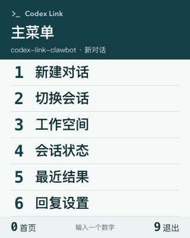

# 微信单键数字菜单

手机用户只需输入一个数字即可完成高频操作。菜单以短编号和大字列表为中心，普通操作不要求打开网页。



[原始图片](wechat-menu.png) · [会话列表](wechat-menu-threads.png)。预览使用测试数据。

## 首页与固定按键

发送 `0`、`菜单`、`Codex` 或 `Codex Link` 打开首页。

| 数字 | 首页功能 | 行为 |
| --- | --- | --- |
| 1 | 新建对话 | 在展示的工作空间准备新会话意图，首条请求才创建线程；当前执行继续 |
| 2 | 切换会话 | 显示最近会话，每页四项，按编号选择 |
| 3 | 工作空间 | 每页四项，切换后继续该空间原来的会话 |
| 4 | 会话状态 | 列出运行会话（含接收附件和外部 Codex 执行），选择后管理；无运行项时显示当前会话 |
| 5 | 最近结果 | 查看保留记录、分页阅读文字、重发结果或重跑失败请求 |
| 6 | 回复设置 | 选择可用模式与回答图片风格，锁定入口；网页地址是次级选项 |

所有页面固定 `0` 回首页、`9` 退出；分页显示 `7` 上一页、`8` 下一页，只展示当前能用的翻页键。全角数字也可以输入。切换目标成功后自动退出菜单，直接发送工作内容即可。

新建对话不要求手动取名，首次任务仍会自动命名。会话切换无需等待原执行结束，也不会中断原会话的结果回传。锁定入口时回复 `1` 输入解锁码；密码输入页的内容绝不提交给 Codex。

## 忙碌时的操作菜单

同一会话准备输入或执行期间再次下令，立即展示“提交失败”，说明“本条指令未提交，也不会稍后执行”。只保存拒绝回执，不保存正文或附件。

| 数字 | 操作 |
| --- | --- |
| 1 | 刷新原会话状态 |
| 2 | 打断本次执行，回复 1 确认；不可打断时隐藏 |
| 3 | 切换会话 |
| 4 | 新建对话 |

打断绑定具体请求 ID 或观察到的原生轮次 ID。即使用户已经切换会话或原会话开始新一轮，旧确认也不能误伤其他执行。微信重投被拒消息只重现拒绝说明与会话菜单，永不补执行。

首页 4 的会话管理不改变输入目标。打断请求发出后还要确认原轮次停止；未确认会显示原因，不会假装已取消。附件下载、图片渲染、重发和外部打断不占用整个消息处理流程。

## 小屏阅读

- 主菜单六项，列表每页最多四项，不把全部功能挤在同一张图。
- 一次导航正常只发送一张图片。图片关闭、渲染失败或投递失败时，回退到同编号的文字菜单。
- 数字与选项左对齐，数字 27 px、首页选项 23 px、列表标题 19 px；背景保持高对比。
- 320 px 逻辑宽度，首页 400 px 高，输出 640 × 800 PNG；其他页面按内容计算高度，不补无意义留白。
- 默认简洁通知：超过 500 字或带文件/图片链接时先发短说明，回复 0→5 取回。归档失败显示“恢复保存结果”，已经完成的工作不能重跑。
- 回答文字每页最多 500 字，用 `7/8` 继续阅读、`6` 回请求详情，只发送所选页。
- 说明与项目名称适当省略；编号绑定完整业务 ID。切换后的文字回执包含完整会话名称。

配色为深青 `#143F46`、浅白 `#F5F9F8`、墨色 `#173236`、灰青 `#526C70`、暖橙 `#E5A06D`。中文使用 Noto Sans CJK SC／Source Han Sans SC／PingFang SC，编号 Menlo；只用 Lucide 图标。菜单保持统一布局，回答风格偏好只影响回答图片。

## 确认、过期与重投

打断、重新执行、重新投递、清理记录和锁定均先展示具体对象与影响，再回复 `1` 确认。重新执行创建关联原请求的新记录；重新投递只发送冻结结果，不再次调用 Codex。

菜单选择十分钟内有效。普通工作内容或附件会退出菜单并尝试即时执行；会话忙碌时立即拒绝；明确退出后普通数字也能作为任务内容，`0` 仍是菜单快捷入口。未打开菜单、已过期或进程重启后的数字，先回首页而不执行旧选项。解锁输入是例外，过期密码同样不会提交给 Codex。

每页编号绑定展示时的完整工作空间、会话或请求 ID，不能在收到输入时重新按列表下标取目标。执行状态变化、列表插入和网页切换不会把确认动作转移到另一个请求。

菜单会话不跨重启保存。独立 `menu-receipts.json` 只保留来源编号与接收时间，按 30 天滚动清理，不保存输入、解锁码或消息令牌。副作用前先保存收件记录，避免进程重启后整批微信重投再次执行。若恰在收件与执行之间崩溃，不自动补执行，用户检查当前状态后重新选择。旧多位编号菜单与旧状态文件不参与新协议。

## 实现与验证

`number_menu.go` 负责输入、会话有效期和单图发送；`number_menu_pages.go` 构建页面与编号绑定；`number_menu_actions.go` 调用现有目标、线程、请求、偏好与恢复服务；`number_menu_receipts.go` 处理重投。`visual/menu.go` 和 `assets/menu.html` 只负责转义与排版。

```bash
TMPDIR=/private/tmp CLAWBOT_VISUAL_PREVIEW_DIR=/private/tmp/clawbot-number-menu \
  go test ./internal/visual -run '^TestMenuRendersWithInstalledChromium$' -count=1
```

Linux 可使用 `/tmp`。安装中文字体与 Chromium 后可导出首页、会话列表、忙碌拒绝与确认页的 HTML、PNG。不连接真实微信或 Codex。

必要回归覆盖数字不误入任务、完整 ID 绑定、分页、新会话与当前执行隔离、重复与重启重投、确认、结果翻页、重跑去重、锁定解锁、图片失败回退与能力设置。微信实际图片压缩与真机呈现需部署后验收。

2026-09-22 本地验证：`make check` 通过，包含全量竞态检测、构建、静态检查与文档链接检查；使用 Chromium 输出并检查首页、列表、忙碌拒绝与确认页，以及 320 px 预览、192 px 缩略图。未部署，也未连接真实微信或 Codex。

2026-09-23 收尾：首页 4 改为运行中会话入口；结果详情加入恢复保存和清理记录；操作编号按升序展示。附件准备可见可打断，菜单图片发送与工作执行分开，默认长回答按数字取回。手机网页将主要恢复操作前移到详情状态下方。
